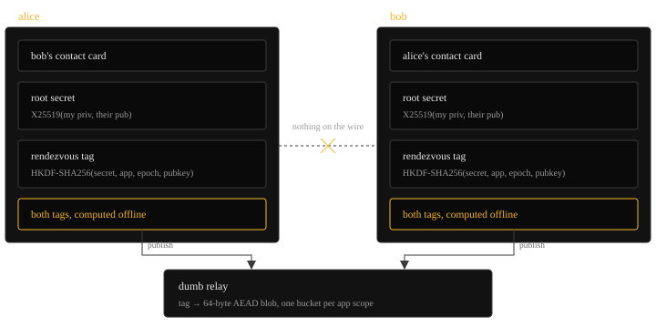

The first pieces of zafu are out as standalone libraries: `@zafu/pq`, `@zafu/zid`, `@zafu/media` and `@zafu/service` are on npm. They do one thing: let any app keep its server-side data as ciphertext the server can't read.

Signal solved encryption in an async environment and delivered a simple chat interface for what used to be a massive coordination problem: the hassle of sending PGP keys back and forth over email, to the point that no one wanted to onboard another person into that crooked system, and the only adoption that happened was email at ProtonMail, with wicked trust assumptions. FROST multisigs have the exact same issue PGP had: a coordination problem. zafu's goal is to solve this off-chain coordination problem as well as to enable the same everywhere else your data lives in someone else's custody: [a poker table](https://zkbtc.org), a chat with [an LLM in a TEE](https://confer.to/blog/2026/01/private-inference/), a notes app, file drop, you name it.

## Packages

[`@zafu/pq`](https://www.npmjs.com/package/@zafu/pq) is the key agreement layer: X25519 mixed with ML-KEM-768 ([X-Wing](https://datatracker.ietf.org/doc/draft-connolly-cfrg-xwing-kem/)), a sealed box on top, raw ML-KEM for protocols doing their own X25519. Every agreement is hybrid, so an attacker breaks both halves or opens nothing. Signatures stay plain ed25519, deliberately: a signature has nothing to harvest, it cannot be forged retroactively, and the day a quantum computer could mint new ones is the day the whole ecosystem rotates signature schemes together. So the post-quantum budget goes entirely where the clock is running - key agreement, where traffic recorded today is decrypted years later.

[`@zafu/zid`](https://www.npmjs.com/package/@zafu/zid) is the identity and transport layer for websites: site-scoped login by signing a server nonce, a sealed box for store-and-forward messages, a live hybrid Noise IK channel (`zafuNoise_IKhybrid_25519+MLKEM768_ChaChaPoly_SHA256`) that fails closed against classical-only peers, and a contact picker that returns opaque handles instead of a social graph. The wallet bridge speaks the message contract in [`@zafu/protocol`](https://www.npmjs.com/package/@zafu/protocol), so both sides compile against one definition of what crosses the wire. It works with no wallet at all: `zid.connect()` falls back to a guest identity, one in-page seed deriving the ed25519 identity and an X-Wing keypair, held in memory by default and burner-grade by design, so an app is usable before anyone installs anything.

[`@zafu/media`](https://www.npmjs.com/package/@zafu/media) is calls: peer-to-peer voice and video with perfect negotiation and optional background blur, written for the poker table and now its own package. SDP/ICE rides the encrypted zid channel; the media itself is direct WebRTC, which exposes each side's IP, so calls are opt-in.

[`@zafu/service`](https://www.npmjs.com/package/@zafu/service) is the layer the other three are wired through, and it is the answer to the question every SDK eventually faces: what changes when the backend does? A service is a function from request to response, a filter wraps one service in another, and a strategy is a named stack of filters the app binds to. Every seam here is injected - the wallet bridge, the presence relay, the socket a call negotiates over - so the same code runs against the extension, against in-page guest keys, or against a relay, and the cross-cutting parts (deadlines, retries, tracing, a feature that is switched off) are filters rather than branches at every call site.

`@zafu/interactions` is the piece being finished now, and the first that faces the *user* rather than the server: the same Service/Filter composition applied to wallet approvals. An app declares intent - approve this, sign this, connect - and the wallet, not the app, decides where it appears: a popup or the side panel, chosen once from the user's own preference so the experience is identical in every app instead of reinvented in each. The surface is part of the user's trust environment, like which keys sign, so it is never the app's call; even the exceptions stay the wallet's, like forcing a full window for an airgap approval whose QR codes a panel is too narrow for. It builds directly on `@zafu/service`, so the routing is filters, not branches.

## Finding a friend without a directory

Encrypting to a key you already have is easy; the hard part is finding a friend's key without uploading your contact list to a server. Signal's answer - an attested enclave with an oblivious-RAM layer - needs a directory to look names up in. ZID keys are random, so there is no such directory; the only handle on a friend's key is a secret the two of you already share.

Two people holding each other's contact card compute the same pairwise root secret locally, from their own private key and the other's public key, with nothing on the wire and neither side needing to be online at the same time. From it each derives the same rendezvous tags: HKDF-SHA256 over the secret, the app origin, the epoch, and the publisher's public key, so the two directions of a friendship are unlinkable. The epoch is [JAM common era](https://graypaper.fluffylabs.dev/#/07f041d?v=0.8.0): six-second slots from a fixed genesis bucketed into five-minute windows off each side's own clock, so there is nothing to negotiate - and because a slot is a u32 count of six-second ticks, the counter runs into the 2840s, with no 2038-style rollover to design around.

*Neither side ever messages the other: each computes both tags offline and looks for the other's.*

Presence goes into a dumb key-value relay under that tag as a 64-byte AEAD blob with the epoch as associated data, so a replay into a later epoch is rejected. Rotating the tag hides the value, not the traffic pattern: a relay serving one GET per tag and seeing one PUT per friend learns friend counts and can rebuild the edges. So the client never reads per tag: it downloads the whole bucket for the app scope and matches locally. Writes are padded to a constant too - 64 entries per epoch, real tags mixed with dummies and shuffled.

An app only sees the present intersection: a handle, an ephemeral session pubkey, and capability bits. Finding a friend in that bucket is a lookup, not a search: you compute the tag they would publish under - a function of your shared secret, the app scope, the epoch, and their card key - and check the bucket you already hold for it. Two people can derive that tag and nobody else can derive it at all, so a hit means "this friend is present" without the relay learning who was looking. The cost is linear, though: every publisher writes 64 entries per epoch, so 10,000 users in one app scope is a bucket of roughly 50 MB that each client downloads every five minutes. That is why the design targets thousands per app scope rather than millions, with prefix sharding as an opt-in that divides the bucket at the cost of leaking which prefix you touched. The wallet half exists too: the extension answers `zafu_discover_contacts` under app-scoped handles, off by default behind a privacy-settings toggle. What it points at is small enough to run yourself - two routes over SQLite, no crypto, [minirelay](https://github.com/rotkonetworks/zafu/tree/main/apps/minirelay) in the repo - so what is missing is a running endpoint, not the code.

## Limits

What this does not do, and where each gap is headed.

**The live channel.** Recording it today buys nothing: each session's ML-KEM key is fresh, so a future quantum computer cannot read what it captured now. Forward secrecy is partial - the handshake is throwaway, and the channel re-keys every 256 messages off the previous key, so a key stolen today cannot read the messages sent before the last re-key.

The gap is recovery from a break-in. Say malware reads your device's memory once and grabs the live session key. Forward secrecy still hides everything you sent before that moment - but from then on the attacker can decrypt the rest of that session, even after the malware is gone, because each new key is derived from the one they already hold. The channel never re-randomizes itself from a secret they didn't see. Closing that means periodically folding in fresh key material so a single break-in stops paying off, the way [Signal's SPQR](https://signal.org/blog/spqr/) does. SPQR itself isn't being ported: it puts post-quantum key material in the header of every message in a 1:1 session, while zafu's channel sends fixed-shape frames and its rooms broadcast one ciphertext to all members. Instead the channel will mix in a fresh ML-KEM exchange at each re-key. That part isn't built yet.

**Contact discovery.** It trades away forward secrecy on purpose, and its keys are not post-quantum yet. The secret behind a rendezvous is a static X25519 value - the price of a lookup that needs no round-trip - so someone who records the relay now and later gets your contact key (or a quantum computer with the two public keys) can reconstruct who was online when. That leaks metadata and the shape of your graph, never message contents - those ride the hybrid channel and sealed box. Both fixes are queued: rotate the contact keys and drop the old ones, and ship `xwing-v1`. Each contact gets their own [XID](https://hackmd.io/@bc-community/SkdxVyY11g), so the identifier stays the same through a rotation, and two contacts can't compare theirs to link you. X-Wing is a KEM rather than a NIKE, so one side has to send the other a ciphertext. Neither the 1216-byte key nor the 1120-byte ciphertext fits in a Zcash memo next to the card - it would take several transactions - so the exchange runs once over the hybrid channel the first time you connect, and the result is cached; the tag, blob, and relay never notice. The first rendezvous between two contacts stays classical.

**Scaling the bucket.** The bucket is linear in publishers, so a big enough app scope will outgrow it. [Penumbra](https://protocol.penumbra.zone/main/crypto/fmd.html) already ships the escape hatch: FMD, fuzzy message detection. A detection key lets a scanner test an entry and answer "possibly yours" or "not yours", with false positives you choose and no false negatives - 16 bits of precision is about one entry in 65,000 - so a client downloads a sliver instead of the whole bucket. Penumbra's version is 68-byte clues against a public clue key, a 32-byte detection key, and a policy that sets the precision from the observed clue rate, so bandwidth is a knob rather than a constant.

Mapped onto this design, a presence entry would carry a clue computed against a clue key the friend publishes in their contact card, and the friend's own detection key would do the matching. Two costs come with that, and both are real: matching is a scan of every entry per query - that is what makes it fuzzy and unindexable - so the scanner has to be a per-user service (self-hostable, or the wallet itself) rather than a shared relay; and that scanner then learns a quantifiable sliver of your friend set, which is the one thing this design otherwise never concedes. So the bucket is the right answer at today's sizes, and FMD behind a per-user scanner is the planned answer when a single scope outgrows it.

**The network itself.** None of this hides who talks to whom - a relay still sees which addresses connect, when, and how much. [Nym's free mixnet SDK](https://zcash-sdk.nym.com/guidance/) (Zcash primitives, runs in the browser) is on the roadmap for the paths that can afford the latency. Calls stay direct on purpose: no middleman on the media means nothing in the middle to record it.

Longer term the relay itself would ideally move onto what Polkadot is building: [a mixnet](https://github.com/paritytech/mixnet/) for the transport, the [bulletin chain](https://polkadotecosystem.com/resources/concepts/bulletin-chain/) for content-addressed blobs that expire unless renewed, and the [statement store](https://polkadotecosystem.com/resources/concepts/statement-store/) for presence - a gossiped topic bus whose TTL and publishing allowances are set on-chain. The appeal is not having to run any of it: existing infrastructure rather than another service we operate. None of it looks settled enough to commit to yet, so the relay stays a dumb key-value store for now.

## Product-market fit in the shielded wallet space

None of this is Zcash, and that is deliberate. Zcash has good desktop and mobile
wallets for what wallets are for: deposit, hold, withdraw. A browser extension
is not going to out-secure or out-mobile them. What the browser has is a social
layer and the ability to extend software people already use. That is why the
spending keys live on Zigner, an air-gapped signer that talks to the wallet over
animated QR codes and nothing else: with the keys cold, the hot extension can be
a poker table with a friend, a client that talks to an LLM in a TEE (confer.to,
Phala, Venice), or any app that would otherwise hand your data to a server,
except the server holds ciphertext and the plaintext is decrypted on your side.

FROST provides the threshold math and zafu already signs with it, so a 2-of-3 spend
never assembles a key anywhere, but it does not make people reachable: that is a
networking problem, and the wallet is well placed to solve it. A ZID is an
identity your contacts already hold, a contact card opens a private channel, an
invite turns a stranger into a counterparty, and presence, once the discovery
relay is wired, says who is online. With those, an escrow is a flow rather than
a protocol project, and the signing still happens on the cold device.

Client-side compute only wins if it is effortless. If encrypting takes a design
decision, a key ceremony, or a second server to run, developers ship the
plaintext version and users never learn there was a choice - so the default
path has to be the encrypted one, with the SDK doing the part that used to be
its own project. That is also where payments come from: apps with their own
users are where value changes hands, and a wallet already holding the keys is
the obvious place to settle it. The economy follows the adoption, not the other
way round.

Key custody is hard, it fails silently, and nobody whose business depends on
reading the data has an incentive to make it easier. The pressure is going to
increase: open models are approaching the point where they find and exploit
software flaws on their own, so cloud services will be compromised at a much
higher rate and the data will spill. So we need client-side encryption
everywhere. Your data should never sit on someone else's server in plaintext:
it is encrypted on your device, by default, before it leaves, so when a server
spills, what spills is unreadable.
